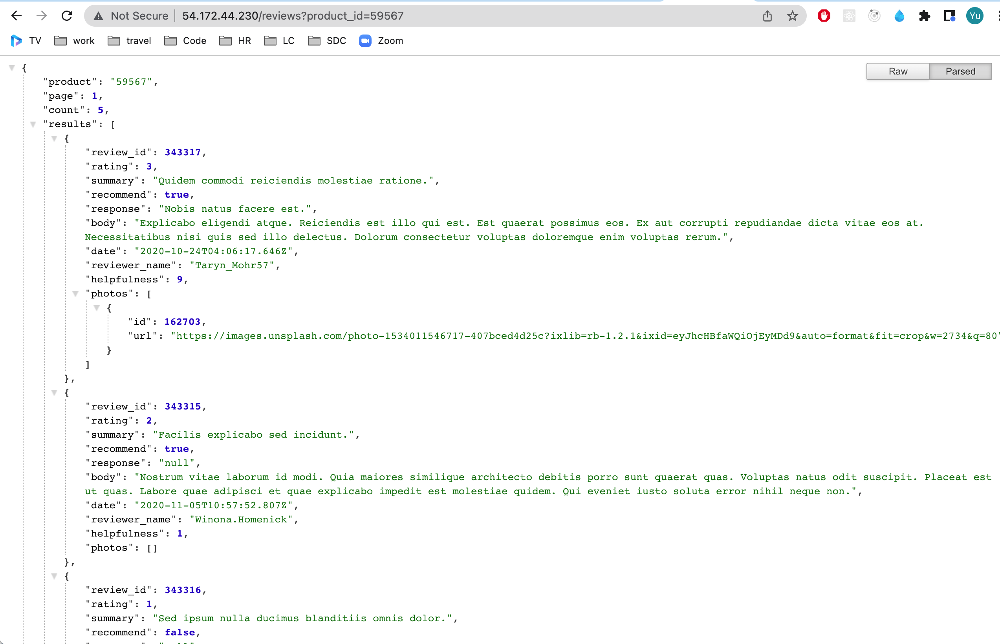
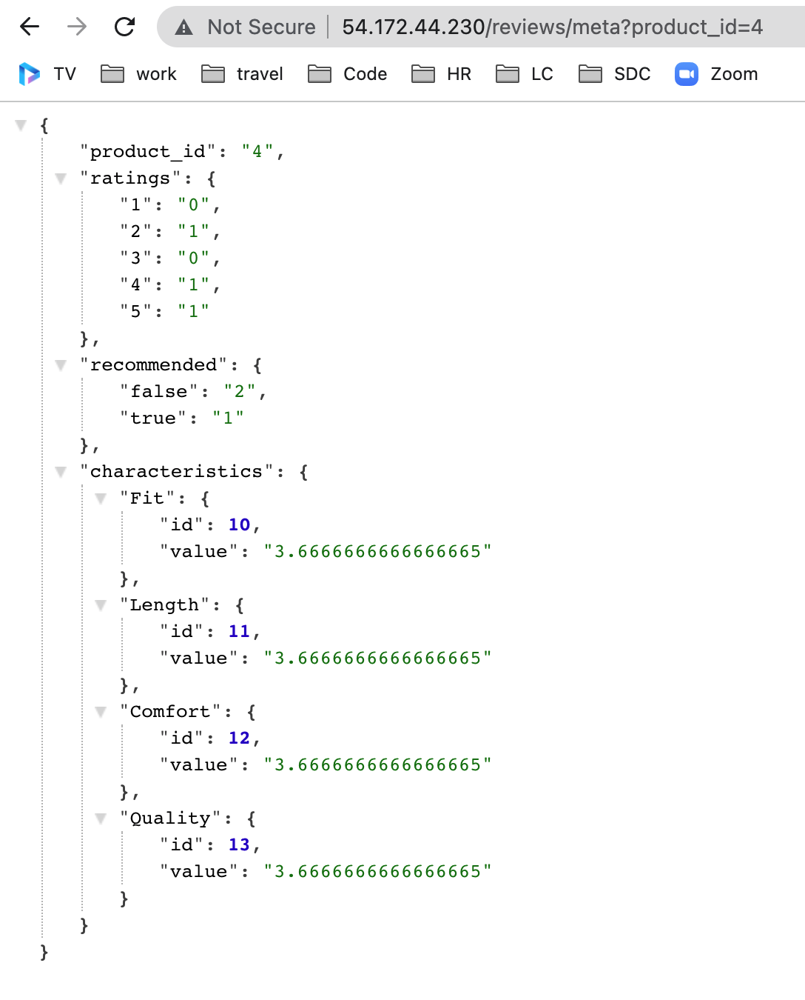
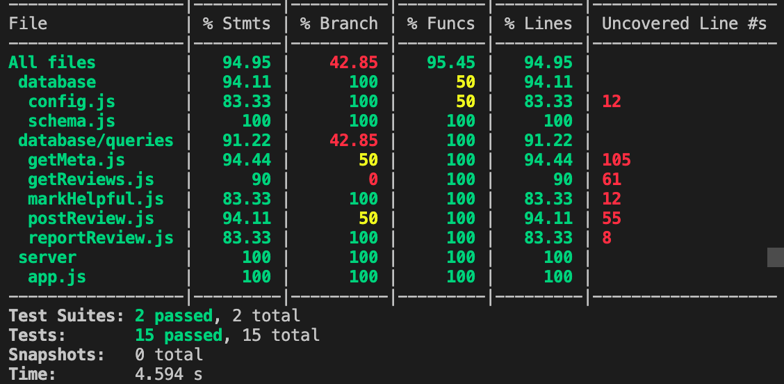
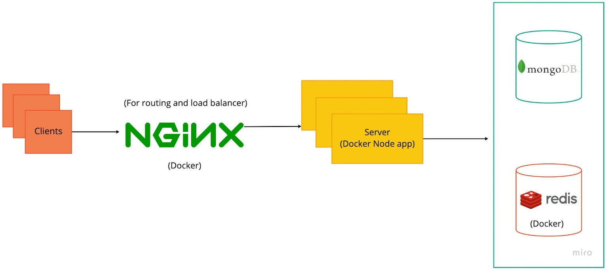

# Reviews-API

Prerequisites & System Design:

-Two endpoints
/reviews
/reviews/meta

-Four collections
reviews
reviewphotos
characteristics
Characteristicreviews

Jest and Supertest:

-Mock functions to test the interaction between the server and database. They can test whether database query functions are called correctly without the implementation of the function

-Created a mock database for the database test, so I don’t need to touch my production database. The test is connected to the mock. I implement the queries on the mock data. Once the test is done, I’ll kill the connection, so it’s not tied to the mock database

Scaling:

-Redis
Redis sits in front of the database to handle serving content
Save & get data from Redis
Put & post: delete the key from the Redis to avoid stale data, maintain consistency between database and cache

-Load balancing
Duplicated servers in docker compose
Nginx config was updated to handle the upstream of multiple servers
